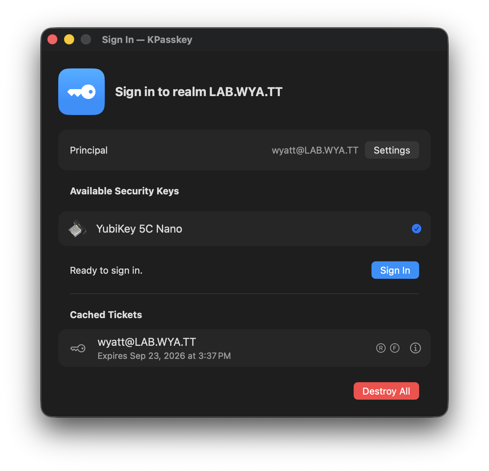

# KPasskey

**KPasskey** is a native macOS menubar application that implements the [SSSD Passkey Kerberos pre-authentication mechanism](https://sssd.io/design-pages/passkey_kerberos.html). Put another way, it lets you use a USB FIDO2 passkey to obtain a ticket-granting ticket (TGT) from a compatible KDC running `ipa-otpd` (namely, FreeIPA).

## Using KPasskey

You'll need an Apple Silicon Mac, a USB FIDO2 key already enrolled for your account, and a compatible KDC with passkey authentication and anonymous PKINIT enabled. You'll also need the realm's CA certificate from your administrator so KPasskey can verify that it's talking to the right KDC.

Download the DMG from [Releases](https://github.com/wyattanderson/kpasskey/releases) and drag KPasskey into Applications. If you'd rather build it yourself, the [build and release guide](docs/BUILD.md) covers local builds and signing.

## Background

On Linux, passkey Kerberos authentication is supported through the SSSD `sssd_krb5_passkey_plugin`, which works with the `clpreauth` and `kdcpreauth` plugin mechanisms conveniently available in MIT Kerberos. macOS uses Heimdal Kerberos, which has no such convenient plugin mechanism. So, we can't use or extend native macOS `kinit` to support passkeys, but we _can_ obtain a TGT with a passkey via an out-of-band mechanism (like KPasskey) and write it to the `API:` KCM (Kerberos Credential Manager) credential cache via Mach RPC. TGTs obtained in this way are then usable by any macOS-native Kerberos client like Google Chrome and NFS file sharing.

## How does it work?

We can't extend Heimdal Kerberos (the native macOS Kerberos client that you get if you run `kinit`) to do what we want, but we _can_ build and extend MIT Kerberos with our own plugin that implements the same passkey preauthentication protocol that FreeIPA expects. Even better, we can package it with `libfido2` in a macOS-native menubar application with some extra conveniences and a nice UI.

What we _can't_ do is use macOS AuthenticationServices `ASAuthorization` API (i.e. passkeys backed by Touch ID and the Secure Enclave), because Apple (probably justifiably) is much more restrictive about how those credentials can be used. They can't be used with an arbitrary domain (only a specific one burned and signed into the application), and they only work with the native FIDO2 challenge format, which FreeIPA doesn't use.

Still, I have a pile of YubiKeys and, for me at least, it makes me feel better about using Kerberos in my homelab.

## Security

Both the KPasskey interactive [application](app/App.entitlements) and [worker process](xpc/Worker.entitlements) are sandboxed. The underlying Kerberos exchange is all powered by MIT `krb5` and `libfido2`.

Passkey sign-in verifies the KDC before asking your key to authenticate, and won't fall back to a password. Passwords and PINs aren't saved. There's more about the authentication flow, how tickets reach other macOS applications, and the security and compatibility tradeoffs in [How KPasskey works](docs/ARCHITECTURE.md).

## AI Usage Disclosure

I'm a professional software engineer with nearly two decades of experience, but my experience is with distributed systems, not macOS applications. This application was largely written with Codex, but heavily steered and influenced by me.
