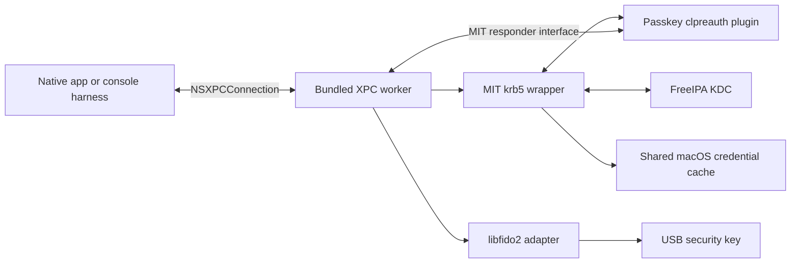

# Architecture and XPC boundary

## Process ownership

The application owns presentation and persistent settings. The worker owns
operation state, MIT contexts, blocking library work, temporary secrets,
device handles, and credential publication. The plugin is a small C ABI adapter
loaded into that worker, not a separate service and not an AppKit component.

Implement these components and their tests in Swift, using modern Swift tooling
and Swift Testing as required by [AGENTS.md](../AGENTS.md). The plugin's C ABI
describes its interface, not a requirement to implement its logic in C. A C or
Objective-C shim is allowed only for a documented interoperability limitation
that makes it absolutely and functionally necessary; keep it minimal.

Use NSXPCConnection with Objective-C-compatible protocols and Foundation secure
coding types implemented in Swift through Objective-C interoperability. Use
Swift for the typed client adapter and its async APIs. XPC connects
processes; it does not deliver work directly to the UI thread. The client
adapter must explicitly dispatch presentation updates to the main actor.
Apple documents the underlying model in [Creating XPC Services](https://developer.apple.com/library/archive/documentation/MacOSX/Conceptual/BPSystemStartup/Chapters/CreatingXPCServices.html).

Prefer an embedded, per-user `.xpc` service inside the app bundle. No root
helper, system-wide daemon, login integration, or App Sandbox escape is needed.
Dropping the App Store requirement does not remove process separation or
code-signing requirements.

## Harness hosting

A loose console executable must not be assumed to discover an app-embedded XPC
service. In milestone 2, build a minimal host `.app` containing the console
executable and the same service bundle, and invoke that executable directly
from a terminal. Prove service lookup and lifecycle with the chosen packaging.
The host has no graphical UI; its interactions are text and secure terminal
input. Do not substitute a shell subprocess or test-only IPC protocol.

## Proposed message contract

These are semantic operations, not finalized Swift signatures.
Milestone 2 must specify exact allowed classes, size limits, ownership, and
error codes before implementing authentication.

| Direction | Operation | Meaning |
| --- | --- | --- |
| Client to worker | Negotiate | Protocol version and supported operation types |
| Client to worker | Start authentication | Request ID, auth mode, immutable settings snapshot; acknowledgment only |
| Worker to client | Progress | Request ID, sequence, structured stage and safe metadata |
| Worker to client | Request interaction | Request ID, interaction ID, type, deadline, bounded prompt metadata |
| Client to worker | Submit interaction | IDs and typed response, such as device choice or secret bytes |
| Client to worker | Cancel | Request ID; idempotent acknowledgment |
| Worker to client | Complete | Exactly one terminal success, cancellation, or categorized failure |

Expected interaction types are password, security-key selection, PIN, and
device presence/verification guidance. Authentication results contain principal,
realm, cache reference, expiry/renewal metadata, and authentication mode. Do not
send raw tickets, session keys, FAST armor keys, or native library pointers to
the UI. The device PIN belongs to the selected device, not indiscriminately to
all attached authenticators.

Settings use a schema version separate from the XPC protocol version. Client
input is validated again in the worker. Disallow arbitrary plugin paths, shell
commands, environment changes, or file-write destinations in the contract.

## Scheduling and lifecycle

- Initially permit one active authentication operation per connection/worker
  policy; reject extra starts explicitly. Add concurrency only when needed.
- Create a fresh MIT context and configuration snapshot per operation.
- Run synchronous MIT/libfido2 work on dedicated execution resources. Keep XPC
  dispatch and cancellation responsive while a library call or prompt waits.
- A synchronous MIT responder may bridge to an XPC interaction and wait on the
  operation thread. It must never block the UI or the queue receiving the reply.
- Map request/interaction IDs to a strict state machine. Reject stale answers
  and avoid presenting duplicate prompts on retry or replayed callbacks.
- On connection loss, stop interactive work, close handles, erase owned secret
  buffers, and discard unpublished credentials. A fresh connection starts fresh;
  it does not silently resume an old authentication transaction.
- Cancellation acknowledges intent separately from terminal completion. Use
  supported device cancellation and bounded network/device operations. If a
  call cannot be interrupted, suppress publication and finish cleanup before
  reporting its terminal outcome. Test the race at the publication boundary.
- Keep transient credential state private until success. Define cleanup at the
  commit point so failure does not remove a preexisting user's cache.

## Error and trust model

Distinguish configuration errors, KDC transport failures, rejected credentials,
device absence, unsupported key, PIN-required/invalid/blocked, user cancellation,
deadline expiry, protocol violations, worker loss, and cache publication failure.
Keep underlying error codes for sanitized diagnostics; user-facing wording is
owned by the client. Avoid raw arbitrary error payloads and secret-bearing logs.

Verify connecting peers using available process/code-signing identity, bound
to our own app or harness. Development signing is an explicit policy, not a
production identity bypass. Constrain decoded object graphs and message sizes.
Erase mutable secret buffers where feasible and document unavoidable copies
made by UI, serialization, and framework layers. Never claim XPC guarantees
zero-copy secret storage or universal erasure.

Private keys stay on the hardware authenticator. Optional password persistence
would require an explicit future Keychain design; the initial worker does not
persist passwords or PINs.
