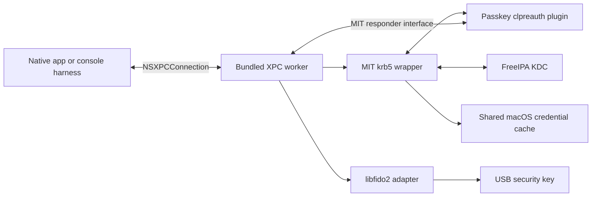

# Architecture and XPC boundary

## Process ownership

The application owns presentation and persistent settings. The worker owns
operation state, MIT contexts, blocking library work, temporary secrets,
device handles, and credential publication. The plugin is a small C ABI adapter
loaded into that worker, not a separate service and not an AppKit component.

Implement these components and their tests in Swift, using modern Swift tooling
and Swift Testing as required by [AGENTS.md](../AGENTS.md). The plugin's C ABI
describes its interface, not a requirement to implement its logic in C. A C or
Objective-C shim is allowed only for a documented interoperability limitation
that makes it absolutely and functionally necessary; keep it minimal.

Use NSXPCConnection with Objective-C-compatible protocols and Foundation secure
coding types implemented in Swift through Objective-C interoperability. Use
Swift for the typed client adapter and its async APIs. XPC connects
processes; it does not deliver work directly to the UI thread. The client
adapter must explicitly dispatch presentation updates to the main actor.
Apple documents the underlying model in [Creating XPC Services](https://developer.apple.com/library/archive/documentation/MacOSX/Conceptual/BPSystemStartup/Chapters/CreatingXPCServices.html).

Prefer an embedded, per-user `.xpc` service inside the app bundle. No root
helper, system-wide daemon, login integration, or App Sandbox escape is needed.
Dropping the App Store requirement does not remove process separation or
code-signing requirements.

## Harness hosting

A loose console executable must not be assumed to discover an app-embedded XPC
service. In milestone 2, build a minimal host `.app` containing the console
executable and the same service bundle, and invoke that executable directly
from a terminal. Prove service lookup and lifecycle with the chosen packaging.
The host has no graphical UI; its interactions are text and secure terminal
input. Do not substitute a shell subprocess or test-only IPC protocol.

## Milestone 2 message contract

The implemented protocols are `WorkerProtocol.exchange(_:reply:)` and
`ClientProtocol.receive(_:)` in `xpc/Contract.swift`. Both exchange immutable
`Message: NSObject, NSSecureCoding` objects. `WorkerClient` is the shared
main-actor async adapter; the console uses its `connect`, `start`, `respond`,
`cancel`, and `disconnect` methods and receives presentation events on the
main actor. Its lower-level `exchange` method also exercises invalid commands.

Protocol version 1 supports only `fake`. Each connection must negotiate before
starting. A mismatched version returns `unsupportedVersion`; it does not change
negotiated state. The negotiation reply includes the fake worker PID for the
harness's process-boundary and termination checks. There is no authentication
mode, credential result, or device API in this implementation.

| Direction | Operation | Meaning |
| --- | --- | --- |
| Client to worker | Negotiate | Protocol version and supported operation types |
| Client to worker | Start | UUID operation ID and immutable fake configuration snapshot; acknowledgment only |
| Worker to client | Progress | Request ID, sequence, structured stage and safe metadata |
| Worker to client | Request interaction | Operation UUID, new interaction UUID, sequence, stage, remaining deadline in milliseconds |
| Client to worker | Submit interaction | IDs and the stage-specific `key-1` or `continue` response |
| Client to worker | Cancel | Request ID; idempotent acknowledgment |
| Worker to client | Complete | Exactly one terminal fake success, cancellation, or categorized failure |

`Message.kind` is one of the command names `negotiate`, `start`, `respond`,
`cancel`; replies use `negotiated` or `ack`; callbacks use `progress`,
`interaction`, or `terminal`. `value` carries the capability, stage, answer,
or `Status` category according to that kind. Unused fields must be empty/zero
and configuration may occur only on a start. Operation and interaction IDs are
canonical uppercase UUID strings, so changing letter case cannot bypass replay
protection. The worker repeats validation after secure decoding. Unknown
commands and illegal field combinations return `protocolViolation`; invalid
secure archives cause XPC to reject the message/connection. The client checks
reply versions, categories, callback shapes, and contiguous event sequences.

The allowed request/reply object graph is exactly `Message`, `Snapshot`, and
`NSString`; callbacks allow `Message` and `NSString`. Nested decoders specify
the same concrete classes. There are no arbitrary dictionaries, `NSError`
payloads, native pointers, or executable/resource paths. Limits are measured in
UTF-8 bytes: kind 32, IDs 36, value/principal/realm 256 each. Decode validation
bounds accepted objects, not Foundation's transient allocation of a hostile
archive. Framework transport limits still apply before these semantic checks.

`Snapshot` schema 1 holds principal, realm, scripted `success`/`failure`, and
an operation timeout from 200 through 30,000 milliseconds. Names must be
nonempty and contain no control characters. These fields are immutable and
owned by the operation; synthetic console defaults are not product Kerberos
defaults. M3 defines the real configuration schema separately. No secrets are
accepted in M2. The scripted stages are `started`, `selectKey`, then `touch`.
Each interaction reports the remaining shared operation deadline; answering a
prompt does not extend it. The worker enforces a monotonic deadline and checks
it again when accepting a response. Relative remaining time is a presentation
hint; the worker remains authoritative.

Acknowledgments use `ok`, `unsupportedVersion`, `protocolViolation`, `busy`,
or `staleInteraction`. Worker terminals use `ok`, `scriptedFailure`,
`cancelled`, or `deadlineExceeded`. Fake `ok` does not claim a ticket exists.
The adapter synthesizes `workerLost`, `disconnected`, or `protocolViolation`
when the transport disappears or misbehaves, and suppresses later callbacks
for that operation. Authentication-specific categories below belong to M3/M4.

Future authentication interaction types are password, security-key selection, PIN, and
device presence/verification guidance. Authentication results contain principal,
realm, cache reference, expiry/renewal metadata, and authentication mode. Do not
send raw tickets, session keys, FAST armor keys, or native library pointers to
the UI. The device PIN belongs to the selected device, not indiscriminately to
all attached authenticators.

Settings use a schema version separate from the XPC protocol version. Client
input is validated again in the worker. Disallow arbitrary plugin paths, shell
commands, environment changes, or file-write destinations in the contract.

## Scheduling and lifecycle

M2 permits one active operation per connection. A second start returns `busy`
without cancelling or replacing the first and receives no terminal event.
Completed operation IDs cannot be reused on that connection. Replay history
is bounded at 1,024 accepted starts; reconnect to start a fresh session after
that limit. Each operation's callbacks start at sequence 1. Stale/wrong-stage
responses never advance the active operation. Duplicate cancellation is an
idempotent `ok`, including unknown or finished IDs, and emits no extra terminal.

Cancellation and timer handling run on the same main actor as the fake state
machine; no task blocks that actor on terminal input. Cancellation cleanup and
terminal emission occur during handling of the cancel command, independently
of reply delivery order. The adapter gives cancellation one second to finish,
then invalidates the connection and emits a single `workerLost` terminal if
necessary. Negotiation allows fifteen seconds for launchd's crash-restart
throttle; ordinary RPCs have a five-second watchdog. Operation completion has
the configured deadline plus one second of transport allowance. These are
software scheduling bounds, not a guarantee while a process or OS is suspended.
M3 must establish new bounds for blocking Kerberos calls.

Interruption, invalidation, and explicit disconnect end that connection's
operations, cancel timers, clear replay state, and resolve all pending client
continuations. A disconnected worker cannot deliver its own terminal; the
adapter supplies that outcome locally. `connect()` creates a new generation,
renegotiates, and ignores callbacks from previous generations. There is no
automatic retry/resume or credential publication. Independent connections
have independent state; M2 does not claim worker-global authentication locking.

- Initially permit one active authentication operation per connection/worker
  policy; reject extra starts explicitly. Add concurrency only when needed.
- Create a fresh MIT context and configuration snapshot per operation.
- Run synchronous MIT/libfido2 work on dedicated execution resources. Keep XPC
  dispatch and cancellation responsive while a library call or prompt waits.
- A synchronous MIT responder may bridge to an XPC interaction and wait on the
  operation thread. It must never block the UI or the queue receiving the reply.
- Map request/interaction IDs to a strict state machine. Reject stale answers
  and avoid presenting duplicate prompts on retry or replayed callbacks.
- On connection loss, stop interactive work, close handles, erase owned secret
  buffers, and discard unpublished credentials. A fresh connection starts fresh;
  it does not silently resume an old authentication transaction.
- Cancellation acknowledges intent separately from terminal completion. Use
  supported device cancellation and bounded network/device operations. If a
  call cannot be interrupted, suppress publication and finish cleanup before
  reporting its terminal outcome. Test the race at the publication boundary.
- Keep transient credential state private until success. Define cleanup at the
  commit point so failure does not remove a preexisting user's cache.

## Error and trust model

Distinguish configuration errors, KDC transport failures, rejected credentials,
device absence, unsupported key, PIN-required/invalid/blocked, user cancellation,
deadline expiry, protocol violations, worker loss, and cache publication failure.
Keep underlying error codes for sanitized diagnostics; user-facing wording is
owned by the client. Avoid raw arbitrary error payloads and secret-bearing logs.

## Peer authorization

Both endpoints call `NSXPCConnection.setCodeSigningRequirement` before
activation. macOS checks actual peer code identity on messages, avoiding PID
lookup races and any trust in a bundle ID supplied over XPC. The listener also
requires the connecting effective UID to equal its own. Service listeners do
not support the listener-wide requirement API, so enforcement is installed
on each accepted connection before any exported method can execute.
See Apple's [connection signing requirement API](https://developer.apple.com/documentation/foundation/nsxpcconnection/setcodesigningrequirement(_:)).

Release/default builds require an Apple-anchored peer with the expected signing
identifier and the same Team ID as the running endpoint. Team IDs come from
Security.framework signing information for the current process, never messages,
settings, or environment variables. Missing Team ID fails closed. Host and worker
identifiers are fixed in the shared contract. Release tests parse the requirement,
reject ad-hoc code and malformed identity inputs, and verify that an ad-hoc host
cannot connect with the default build. Positive Developer ID signing, notarization,
and distribution remain release acceptance work requiring the release identity.

`--config=development` explicitly compiles the ad-hoc fallback. With no Team ID,
it checks the expected peer bundle's signature and identifier, reads its code
hash, and requires that exact identifier/hash on the live XPC peer. The host
uses its embedded worker; the worker uses its enclosing host. Paths derive from
bundle layout and survive relocation. This policy trusts the developer-controlled
bundle on disk: a local user able to replace that entire bundle can replace its
development trust roots. It is not a distribution security policy. A team-signed
development build still uses the release requirement. Tests cover genuine local
peers and a differently signed executable claiming the same host identifier.

Constrain decoded object graphs and message sizes.
Erase mutable secret buffers where feasible and document unavoidable copies
made by UI, serialization, and framework layers. Never claim XPC guarantees
zero-copy secret storage or universal erasure.

Private keys stay on the hardware authenticator. Optional password persistence
would require an explicit future Keychain design; the initial worker does not
persist passwords or PINs.
