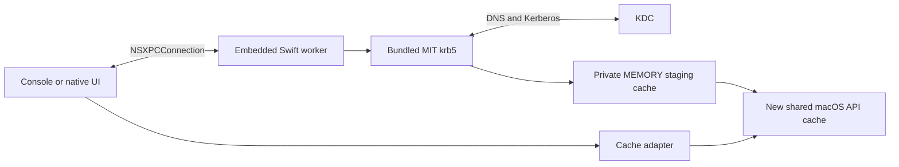

# Architecture and XPC boundary

The host owns presentation and effective settings. The embedded, unprivileged
XPC worker owns authentication contexts, blocking authentication, temporary secrets and
credential publication. The console and native UI share the main-actor
`WorkerClient` and observable `Authentication` presentation adapter. The presentation adapter owns the active operation,
prompt consumption, response validation, cancellation intent and terminal result.
Passwords and PINs are passed directly for one response, never stored in its
observable state. The native app also uses a `TicketCache` adapter on
a utility task to enumerate the shared macOS API cache collection. Native cache
handles and credential contents stay on that task and are freed after each scan;
only principal, lifetime, flags and authentication-method metadata reach observable state.
The main window groups security keys and cached ticket-granting tickets in settings-style
rows. Ticket details invoke the system `klist --verbose` for the explicitly named cache.
Destroy removes that cache and its service tickets through the cache API after checking
that the displayed ticket still matches. Both operations run off the main actor.
Destroy All applies the same checks once per listed cache and reports partial failures.
No global Mach service,
launch agent, root helper or shell authentication subprocess is installed.
`XPCService.JoinExistingSession` is explicitly true: GSSCred partitions caches
by audit session, so a separate worker session would hide its tickets from
system consumers and discard them when that session ends. This uses the native
[XPC session setting](https://developer.apple.com/library/archive/documentation/MacOSX/Conceptual/BPSystemStartup/Chapters/CreatingXPCServices.html),
not custom credential-daemon IPC.

The app observes Apple's
[cache-change notification](https://github.com/apple-oss-distributions/Heimdal/blob/main/lib/heimcred/gsscred.m)
(`com.apple.Kerberos.cache.changed`), debounces bursts, and allows only one scan
at a time. It also refreshes on launch, wake, activation and explicit refresh.
A five-minute timer with tolerance covers lost notifications and service restarts;
if notification registration fails, the fallback is once a minute. Local one-shot
timers handle the 15-minute warning and expiry without cache I/O, including while
menus track. Monitoring needs no subprocess, filesystem watch or network request.

Status describes home-realm ticket-granting tickets across all shared API caches;
service tickets and cache-configuration records do not count as sign-in tickets.
Private MEMORY/FILE caches and other users' or audit sessions' caches are outside
this shared collection. The badge prefers a usable passkey TGT, then another
usable TGT, then the latest expired TGT. A chosen ticket expiring in less than
15 minutes is orange; otherwise passkey is green and password/unreported is
yellow. Expired is red, and no TGT has no pill. Read errors or unusable future/
invalid tickets have no pill and an explicit unavailable status.

MIT's existing TGT-scoped `pa_type` cache entry identifies passkey or password
preauthentication. Heimdal can omit this entry, so the app labels those tickets
“Authentication method unreported” and uses yellow. These are local cache hints,
not verified [KDC authentication indicators](https://www.rfc-editor.org/rfc/rfc8129),
which are inside the encrypted ticket and unavailable to this cache reader.

The passkey plugin, libfido2 adapter and FAST armor extend the worker in
milestone 4. Password mode enables only encrypted-timestamp preauthentication
and performs no device operations or PKINIT. Swift implements the contracts,
worker, adapters, console and tests, following [AGENTS.md](../AGENTS.md).
Declaration-only Clang modules expose upstream C libraries; no C/Objective-C
implementation shim is needed.

## Wire contract

`WorkerProtocol.exchange(_:reply:)` and `ClientProtocol.receive(_:)` exchange
immutable `Message: NSObject, NSSecureCoding` envelopes. The protocol
negotiates `fake,password,passkey,devices`; older peers are rejected. The negotiation reply
includes the verified worker PID for process-boundary tests. Fake success never
claims a credential exists.

| Kind | Contents and behavior |
| --- | --- |
| `negotiate` / `negotiated` | Version and capabilities, required before start |
| `start` / `ack` | New UUID and immutable `Snapshot`; acknowledgment only |
| `devices` / `devices` | Connection-scoped inventory with opaque IDs, sanitized names and allow-listed image names |
| `progress` | Operation ID, contiguous sequence and start, armor, authentication, touch or onboard verification stage |
| `interaction` | Operation ID, fresh interaction UUID, stage and remaining milliseconds |
| `respond` / `ack` | Matching IDs and a stage-specific response |
| `cancel` / `ack` | Idempotent cancellation intent |
| `terminal` | Exactly one status, optional numeric MIT error and success metadata |

`Snapshot` schema 1 retains the scripted M2 fields and adds an optional typed
`Configuration` schema 1. Its `mode` selects password or passkey authentication;
legacy synthetic principal/realm/outcome fields are then unused. Operation
timeout is taken from the effective real configuration. The console selects
password mode with `--password`, passkey mode with `--passkey`, or either using
`--settings`; no arguments retain the
scripted harness for boundary regression tests.

Fake interactions accept `key-1` for `selectKey` and `continue` for `touch`.
Password mode sends a `password` interaction. Its response has an empty text
value and a separate `Data` secret, nonempty, at most 4 KiB and without NUL.
Unexpected additional MIT prompter calls are rejected, including password
changes; raw library prompts are not displayed or logged.

Passkey mode starts native work immediately and bridges MIT responder questions
to `selectDevice` and `pin` interactions. A device menu contains at most sixteen
sanitized labels of at most 128 UTF-8 bytes. Responses use `device-0` through
`device-15`, scoped to the worker's current manifest; paths never cross XPC.
A single key is selected automatically. PINs use the secret field and must be
valid UTF-8, at least four Unicode scalars, and at most 63 bytes. Touch/onboard
UV are progress events; the device completes them. The console's hidden read
also stops on terminal outcomes, restoring terminal settings promptly.

The native sign-in window refreshes the libfido2 manifest while visible in passkey
mode. AppKit window occlusion notifications cancel polling when the window is
closed, minimized, hidden, off the active Space, or fully covered; becoming visible
starts an immediate refresh. A scan already in flight may finish after hiding,
but its cancelled UI task discards the result and schedules no further scans.
Rows retain identity across scans, animate insertion/removal, and prefer
a newly attached key while idle. The selected opaque ID is included in the
operation snapshot and resolved inside that worker connection. Removing it never
redirects authentication to a different key. The console retains its operation
manifest menu when it supplies no preselection.

Discovery runs off the main actor. Metadata reads finish before a new native
operation starts; scans during authentication only enumerate, without opening
devices. USB manufacturer/product strings are the fallback label. YubiKey metadata
is read once per attachment using the read-only CTAPHID management command used by
Yubico's `yubikit.management`. Known form factors, NFC support and product families
drive the name and image mapping from `yubikit.support` and Yubico Authenticator's
`lib/widgets/product_image.dart`. Unknown or unreadable metadata keeps the USB label.
This metadata is cosmetic and establishes no authentication trust. Product images,
Apache license and attribution are included in the app bundle; adapted manager
naming rules carry their separate BSD notice.

libfido2 provides enumeration but no public hotplug subscription or vendor-command
API. The visible window uses bounded manifest polling. The bundled static library's
`fido_tx`/`fido_rx` transport routines supply vendor-command framing through the
declarations in `third_party/swift/libfido2.h`. Those internal signatures must be
verified on dependency upgrades. All executable adapter logic is Swift; no custom
USB framing, Python helper, or C implementation shim is introduced.

UUIDs must use canonical uppercase representation. Unused fields must be empty
or zero. Limits are UTF-8 bytes: kinds 32, IDs 36, text values 256. Sequences
are nonnegative; remaining time is 0–30,000 ms. Only start may carry settings;
only password/PIN responses may carry secrets; only successful real terminals
may carry ticket metadata. Both decoder and session validate messages. The
client verifies categories, shapes, contiguous sequences and matching authentication-mode success
metadata, and ignores callbacks from previous connection generations.

The secure object graph is `Message`, `Snapshot`, `NSString`, `NSData` and
`NSArray` (device labels only);
callbacks omit Snapshot. Typed configuration and ticket metadata are encoded
inside bounded binary plists (8 KiB and 4 KiB) and decoded with Codable, then
validated. Device inventories are also bounded binary plists (8 KiB), limited to
sixteen entries with canonical UUIDs, 128-byte labels and allow-listed icon names.
There are no arbitrary object dictionaries, NSError payloads,
filesystem destinations, native pointers, session keys or raw tickets in the
protocol. These semantic limits do not bound Foundation's transient allocation
of hostile archives before decoding; transport limits and peer trust also apply.

Metadata contains principal, realm, API cache reference, expiry, renewal time,
actual forwardable flag and authentication mode. Success is reported only after
publication. See [CONFIGURATION.md](CONFIGURATION.md) for settings and cache
ownership policy.

## Scheduling and lifecycle

Each connection accepts one operation at a time and rejects concurrent starts
with `busy`. Native authentication additionally reserves one process-wide slot,
including while a cancelled call drains. Accepted operation IDs cannot be
reused; replay history is bounded to 1,024 starts, then reconnect is required.
Stale/wrong-stage responses cannot advance the operation. Relative prompt time
is a presentation hint; the worker enforces a monotonic deadline and checks it
again when accepting a response.

State transitions, timers and XPC delivery run on the main actor. Synchronous
MIT work and secure terminal input run on separate execution resources. The
worker collects the password before native work; MIT's prompter never blocks
XPC waiting for an unrepresented interaction. No automatic operation retries
occur, though MIT retains native KDC transport failover.
For passkeys, the native thread waits on a condition variable while the actor
routes responder interactions. Cancellation wakes that wait. A blocked HID
call uses the same process-exit grace as MIT; libfido2 handles are never accessed
concurrently from an unsafe cancellation thread.

Cancellation before the publication gate sends one terminal result promptly,
prevents publication, and acknowledges independently of callback delivery. A
call still draining keeps the worker busy. A worker-only watchdog exits the
process after a 750 ms cancellation grace if native work has not returned,
releasing MEMORY caches even if OS DNS resolution is stuck. Fake operations
need no process exit. The client gives cancellation a one-second fallback bound
and synthesizes `workerLost` if necessary. Reconnect after worker termination;
there is no credential-operation replay.

Publication is the commit point: cancellation after that decision cannot undo
it. Native API-cache RPCs cannot be interrupted through a public API. If the
worker or its reply is lost during commit, the result is unknown to the client;
it must not claim available credentials or destroy a preexisting cache. The
client operation watchdog uses the configured deadline plus one second. Normal
RPCs allow five seconds; negotiation allows fifteen seconds for launchd restart
throttling. These are scheduling bounds, not guarantees while the OS/process
is suspended.

Disconnect invalidates the generation, stops interactions, cancels unpublished
work and resolves pending client continuations. The client supplies a local
terminal result when transport is lost and suppresses duplicate/late events.
Worker cleanup does not depend on a callback reaching a disconnected client.

## Errors and secrets

Statuses distinguish configuration errors, unavailable KDCs, rejected
credentials, unsupported prompts, other authentication failures, publication
failures, cancellation, expiry, protocol errors and worker loss. Numeric MIT
codes supplement sanitized categories; arbitrary remote error descriptions are
not printed. Fake mode additionally has `scriptedFailure`.

The console reads a bounded hidden password from `/dev/tty`, supports Ctrl-C,
EOF, backspace and timeout, and restores terminal settings. Owned mutable
terminal/C buffers are erased. Foundation, XPC and immutable copies cannot
promise universal secret erasure. Passwords are not persisted or accepted in
command arguments, settings, logs or environment. Device PIN interactions and
optional Keychain persistence are separate future designs.

## Peer authorization

Both endpoints call `NSXPCConnection.setCodeSigningRequirement` before
activation. macOS checks actual peer code identity on messages; no bundle ID
supplied in a message or PID lookup establishes trust. The listener also
requires the connecting effective UID to equal its own. Service listeners do
not support the listener-wide requirement API, so enforcement is installed
on each accepted connection before exported methods execute.

The native app and harness have separate, explicitly allowed host/service
identifiers. Each bundles the same worker implementation under its own service
identifier. The worker reads its enclosing bundle's identifier, checks it against
the fixed host allow-list and constructs the signing requirement for that exact
host. Bundle metadata alone never authorizes a connection.

Release/default builds require an Apple-anchored peer with the expected signing
identifier and the same Team ID as the running endpoint. The Team ID comes
from Security.framework signing information, never a message, setting or
environment variable. Missing Team ID fails closed for ad-hoc code. Positive
Developer ID signing, notarization and oldest-OS testing remain release work.

`--config=development` explicitly compiles the ad-hoc fallback. With no Team
ID it verifies the expected bundled peer, reads its code hash and requires that
exact identifier/hash. Host and worker locate each other by bundle layout, so
relocation preserves trust. This policy trusts the developer-controlled bundle
on disk; replacing that entire bundle replaces its development trust roots.
It is not the distribution trust policy. Team-signed development builds still
use the release requirement. Tests cover the genuine peer, a differently signed
imposter claiming the same identifier, and default-policy ad-hoc rejection.
