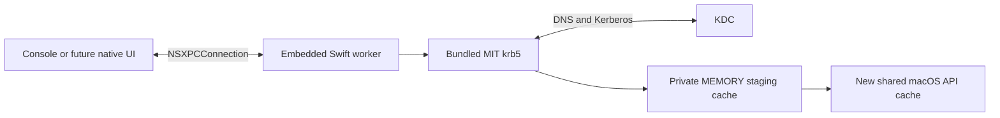

# Architecture and XPC boundary

The host owns presentation and effective settings. The embedded, unprivileged
XPC worker owns MIT contexts, blocking authentication, temporary secrets and
credential publication. The console and future UI share the main-actor
`WorkerClient`; neither calls Kerberos directly. No global Mach service,
launch agent, root helper or shell authentication subprocess is installed.
`XPCService.JoinExistingSession` is explicitly true: GSSCred partitions caches
by audit session, so a separate worker session would hide its tickets from
system consumers and discard them when that session ends. This uses the native
[XPC session setting](https://developer.apple.com/library/archive/documentation/MacOSX/Conceptual/BPSystemStartup/Chapters/CreatingXPCServices.html),
not custom credential-daemon IPC.

The future passkey plugin, libfido2 adapter and FAST armor extend the worker in
milestone 4. Password mode loads none of them. Swift implements the contracts,
worker, adapters, console and tests, following [AGENTS.md](../AGENTS.md).
Declaration-only Clang modules expose upstream C libraries; no C/Objective-C
implementation shim is needed.

## Wire contract

`WorkerProtocol.exchange(_:reply:)` and `ClientProtocol.receive(_:)` exchange
immutable `Message: NSObject, NSSecureCoding` envelopes. Protocol version 2
negotiates `fake,password`; version 1 peers are rejected. The negotiation reply
includes the verified worker PID for process-boundary tests. Fake success never
claims a credential exists.

| Kind | Contents and behavior |
| --- | --- |
| `negotiate` / `negotiated` | Version and capabilities, required before start |
| `start` / `ack` | New UUID and immutable `Snapshot`; acknowledgment only |
| `progress` | Operation ID, contiguous sequence and `started` or `authenticating` |
| `interaction` | Operation ID, fresh interaction UUID, stage and remaining milliseconds |
| `respond` / `ack` | Matching IDs and a stage-specific response |
| `cancel` / `ack` | Idempotent cancellation intent |
| `terminal` | Exactly one status, optional numeric MIT error and success metadata |

`Snapshot` schema 1 retains the scripted M2 fields and adds an optional typed
`Configuration` schema 1. Presence of configuration selects password mode;
legacy synthetic principal/realm/outcome fields are then unused. Operation
timeout is taken from the effective real configuration. The console selects
password mode only with `--password` or `--settings`; no arguments retain the
scripted harness for boundary regression tests.

Fake interactions accept `key-1` for `selectKey` and `continue` for `touch`.
Password mode sends a `password` interaction. Its response has an empty text
value and a separate `Data` secret, nonempty, at most 4 KiB and without NUL.
Unexpected additional MIT prompter calls are rejected, including password
changes; raw library prompts are not displayed or logged.

UUIDs must use canonical uppercase representation. Unused fields must be empty
or zero. Limits are UTF-8 bytes: kinds 32, IDs 36, text values 256. Sequences
are nonnegative; remaining time is 0–30,000 ms. Only start may carry settings;
only password responses may carry secrets; only successful password terminals
may carry ticket metadata. Both decoder and session validate messages. The
client verifies categories, shapes, contiguous sequences and password success
metadata, and ignores callbacks from previous connection generations.

The secure object graph is `Message`, `Snapshot`, `NSString` and `NSData`;
callbacks omit Snapshot. Typed configuration and ticket metadata are encoded
inside bounded binary plists (8 KiB and 4 KiB) and decoded with Codable, then
validated. There are no arbitrary object dictionaries, NSError payloads,
filesystem destinations, native pointers, session keys or raw tickets in the
protocol. These semantic limits do not bound Foundation's transient allocation
of hostile archives before decoding; transport limits and peer trust also apply.

Metadata contains principal, realm, API cache reference, expiry, renewal time,
actual forwardable flag and authentication mode. Success is reported only after
publication. See [CONFIGURATION.md](CONFIGURATION.md) for settings and cache
ownership policy.

## Scheduling and lifecycle

Each connection accepts one operation at a time and rejects concurrent starts
with `busy`. Native authentication additionally reserves one process-wide slot,
including while a cancelled call drains. Accepted operation IDs cannot be
reused; replay history is bounded to 1,024 starts, then reconnect is required.
Stale/wrong-stage responses cannot advance the operation. Relative prompt time
is a presentation hint; the worker enforces a monotonic deadline and checks it
again when accepting a response.

State transitions, timers and XPC delivery run on the main actor. Synchronous
MIT work and secure terminal input run on separate execution resources. The
worker collects the password before native work; MIT's prompter never blocks
XPC waiting for an unrepresented interaction. No automatic operation retries
occur, though MIT retains native KDC transport failover.

Cancellation before the publication gate sends one terminal result promptly,
prevents publication, and acknowledges independently of callback delivery. A
call still draining keeps the worker busy. A worker-only watchdog exits the
process after a 750 ms cancellation grace if native work has not returned,
releasing MEMORY caches even if OS DNS resolution is stuck. Fake operations
need no process exit. The client gives cancellation a one-second fallback bound
and synthesizes `workerLost` if necessary. Reconnect after worker termination;
there is no credential-operation replay.

Publication is the commit point: cancellation after that decision cannot undo
it. Native API-cache RPCs cannot be interrupted through a public API. If the
worker or its reply is lost during commit, the result is unknown to the client;
it must not claim available credentials or destroy a preexisting cache. The
client operation watchdog uses the configured deadline plus one second. Normal
RPCs allow five seconds; negotiation allows fifteen seconds for launchd restart
throttling. These are scheduling bounds, not guarantees while the OS/process
is suspended.

Disconnect invalidates the generation, stops interactions, cancels unpublished
work and resolves pending client continuations. The client supplies a local
terminal result when transport is lost and suppresses duplicate/late events.
Worker cleanup does not depend on a callback reaching a disconnected client.

## Errors and secrets

Statuses distinguish configuration errors, unavailable KDCs, rejected
credentials, unsupported prompts, other authentication failures, publication
failures, cancellation, expiry, protocol errors and worker loss. Numeric MIT
codes supplement sanitized categories; arbitrary remote error descriptions are
not printed. Fake mode additionally has `scriptedFailure`.

The console reads a bounded hidden password from `/dev/tty`, supports Ctrl-C,
EOF, backspace and timeout, and restores terminal settings. Owned mutable
terminal/C buffers are erased. Foundation, XPC and immutable copies cannot
promise universal secret erasure. Passwords are not persisted or accepted in
command arguments, settings, logs or environment. Device PIN interactions and
optional Keychain persistence are separate future designs.

## Peer authorization

Both endpoints call `NSXPCConnection.setCodeSigningRequirement` before
activation. macOS checks actual peer code identity on messages; no bundle ID
supplied in a message or PID lookup establishes trust. The listener also
requires the connecting effective UID to equal its own. Service listeners do
not support the listener-wide requirement API, so enforcement is installed
on each accepted connection before exported methods execute.

Release/default builds require an Apple-anchored peer with the expected signing
identifier and the same Team ID as the running endpoint. The Team ID comes
from Security.framework signing information, never a message, setting or
environment variable. Missing Team ID fails closed for ad-hoc code. Positive
Developer ID signing, notarization and oldest-OS testing remain release work.

`--config=development` explicitly compiles the ad-hoc fallback. With no Team
ID it verifies the expected bundled peer, reads its code hash and requires that
exact identifier/hash. Host and worker locate each other by bundle layout, so
relocation preserves trust. This policy trusts the developer-controlled bundle
on disk; replacing that entire bundle replaces its development trust roots.
It is not the distribution trust policy. Team-signed development builds still
use the release requirement. Tests cover the genuine peer, a differently signed
imposter claiming the same identifier, and default-policy ad-hoc rejection.
